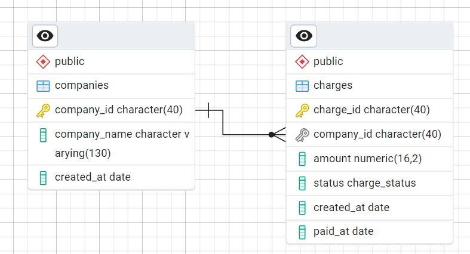

# 1. Etl para procesar datos de un archivo CSV y cargarlo en una base de datos PostgreSQL

Este proyecto es un etl de Python que utiliza la biblioteca `polars` para leer un archivo CSV, procesar, limpiar los datos y cargarlos en una base de datos `PostgreSQL` utilizando `SQLAlchemy`, y `sqlmodel`.

** Explicación del proyecto: **
- Se utiliza `Docker` para crear un contenedor que contiene la base de datos PostgreSQL y el ETL para procesar los datos.
- Se utiliza `docker-compose` para crear y administrar el contenedor de la base de datos PostgreSQL y el contenedor del ETL.
- Se utiliza `PostgreSQL` como base de datos para almacenar los datos procesados, esto debido a que es de tipo relacional, haciendolo ideal para el enfoque del problema por la validacion de los datos y además es open source.
- Se utiliza `polars` para leer, agrupar y limpiar los datos, *elegido por su velocidad y eficiencia en comparación con otras bibliotecas como `pandas`*.
- Se utiliza `SQLAlchemy` para conectarse a la base de datos PostgreSQL y cargar los datos.
- Se utiliza `sqlmodel` para definir el modelo de datos y validar los datos antes de cargarlos en la base de datos.
- Se utiliza `dotenv` para cargar las variables de entorno desde un archivo `.env`.

** Requisitos previos: **
- Tener instalado `Docker` y `docker-compose` en tu máquina.

** Proceso de instalación (posterior a la clonacion del repositorio): **
1. Crear un archivo `.env.prod` en la raíz del proyecto y agregar las variables de entorno que vienen en el archivo `.env.example`.
2. Ejecutar el siguiente comando para construir el contenedor de la base de datos PostgreSQL y el contenedor del ETL:
```bash
docker-compose --env-file .env.prod -f etl/docker-compose.yml build
```
3. Ejecutar el siguiente comando para iniciar el contenedor de la base de datos PostgreSQL y el contenedor del ETL:
```bash
docker-compose --env-file .env.prod -f etl/docker-compose.yml up
```

** Explicación del proyecto del etl: **

> 1.1 Carga de información a Base de datos:
> * Elegí `PostgreSQL` como base de datos para almacenar los datos procesados, basandome principalmente en tres factores:
>   1. Es una base de datos relacional, lo que permite validar los datos antes de cargarlos.
>   2. Es open source, lo que permite utilizarla sin costo alguno.
>   3. Es la base de datos con la que tengo más experiencia, lo que me permite trabajar de manera más eficiente y rápida.
>
> 1.2 Extracción de datos:
> * Se utiliza `polars` para leer el archivo CSV y cargarlo en un DataFrame.
> ** Retos encontrados: **
>   1. La limpieza de los datos fue un poco complicada, ya que el archivo CSV contenía algunos valores nulos y algunos valores no válidos. Para solucionar esto, utilicé la función `filter` de `polars` para eliminar las filas que contenían valores nulos o no válidos y los guarde en la carpeta `generated_data/`, para no perder la información en caso de que se necesite en el futuro.
>   2. El tener que limpiar los nombres y ids de compañias, ya que en el archivo CSV venian o con el nombre de la compañia o con el id de la compañia, por lo que tuve que hacer un mapeo entre los ids y los nombres de las compañias para poder cargar los datos en la base de datos.
>   3. El archivo CSV contenía algunos caracteres especiales no visibles, como saltos de línea y espacios en blanco, que causaban problemas al cargar los datos en la base de datos. Para solucionar esto, utilicé la función `strip_chars` de `polars` para eliminar estos caracteres especiales.
>
> 1.3 Transformación de datos:
> * Se utiliza `polars` para transformar los datos, para las compañias se utiliza una agrupacion y conteo de coindencias entre compani_name y compani_id, porque como se menciono anteriormente, el archivo traia diferentes nombres con el mismo id o con id nulo, por lo que por agrupacion se obtiene el que aparece más veces y se queda como el nombre y id correctos.
> ** Retos encontrados: **
>   1. La agrupación de los datos fue un poco complicada, porque justo, para determinar el nombre correcto y corregirlo ahora en el dataframe original tuve quehacer joins entre los ids y nombres de compañias, para obtener el id correcto y el nombre correcto, ya que en el archivo CSV venian o con el nombre de la compañia o con el id de la compañia o vacio en alguno de los casos.
>   2. El formato de fecha para created_at, venian varios formatos, por lo que se tuvo que normalizar, pero no se uso ningun método de casteo nativo de polars, si no que por medio de expresiones se fueron normalizando los formatos de fecha, para que todos quedaran en el mismo formato YYYY-MM-DD.
>   3. El campo amoount, lo mismo, cuando casteaba a decimal en formato 16,2, no todos los valores eran validos, por lo que se tuvo que hacer un filtro para eliminar los valores no validos y quedarme solo con los validos. y almacenar el resto en `generated_data/`.
>
> 1.4 Dispersión de la información:
> * Se utiliza `SQLAlchemy` para conectarse a la base de datos PostgreSQL y cargar los datos, junto con `sqlmodel` para definir el modelo de datos y validar los datos antes de cargarlos en la base de datos.
> * La base de datos se crea automaticamente al iniciar el contenedor de la base de datos PostgreSQL, pues el docker-compose.yml ya tiene la configuracion para crear la base de datos y el usuario, en cuanto a su estructura, se crea igual en el docker-compose.yml pasando el script de la base de datos ubicado en `etl/db/db_model.sql` (también aqui viene la creación de la vista solicitada más adelante).
>
> ** Diagrama de ERD**

> 
> 1.5 SQL:
> * Se crea una vista llamada `view_daily_company_totals`, va incluida en el script de la base de datos ubicado en `etl/db/db_model.sql`, esta vista permite obtener el total de transaccionado por compañia y por fecha. en cuanto a su estructura, es la siguiente:
```sql
CREATE OR REPLACE VIEW view_daily_company_totals AS
SELECT 
    ch.created_at as fecha,
    co.company_id,
    co.company_name,
    SUM(ch.amount)
FROM charges ch
JOIN companies co ON co.company_id = ch.company_id
GROUP BY fecha, co.company_id, co.company_name
ORDER BY fecha, co.company_name ASC;
```


# 2. Api
